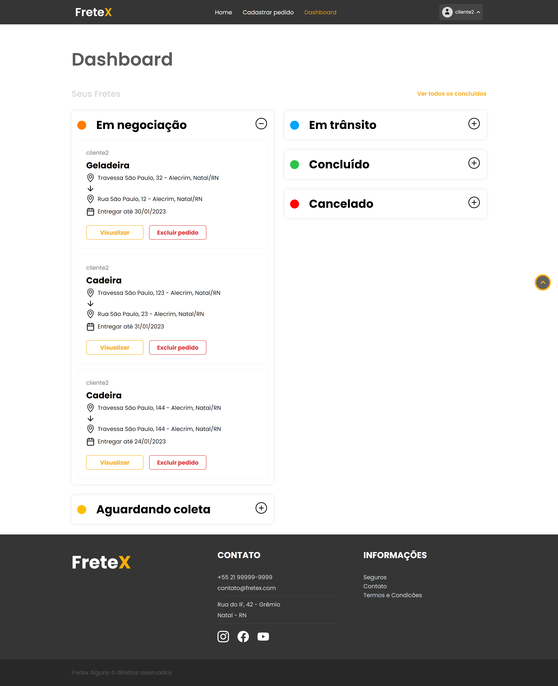

## 
 FRETEX 

**Especificação de Caso de Uso** 

## Listar Meus Fretes. 

## Histórico da Revisão

|**Data** |**Versão** |**Descrição** |**Autor** |
| - | - | - | - |
|08/06/2022 |1.0 |Detalhamento incial. |Italo Gabriel da Silva Monteiro |
|29/10/2022 |2.0 |Segunda versão. |Italo Gabriel da Silva Monteiro |

## 1- Resumo: 

  - O cliente pode listar um ou mais pedidos de frete. 

## 2- Atores:
  - Cliente 

## 3- Precondições: 

- Estar logado. 

## 4- Fluxos de evento: 
**4.1- Fluxo básico:** 

1. O ator seleciona a opção Dashboard. 
2. O sistema verifica os pedidos existentes e retorna uma lista com todos  os  pedidos  cadastrados,  seja  em  situação  de  “em  negociação”,  ”aguardando coleta”, “em trânsito”, “concluído” ou "cancelado". 

**4.2- Fluxo de Exceção – Nenhum pedido cadastrado:** 

  1.  O  sistema  informa  ao  ator  que  ele  não  possui  nenhum  pedido cadastrado. 

## 5- Protótipo(s) de interface do Listar Meus Fretes:

