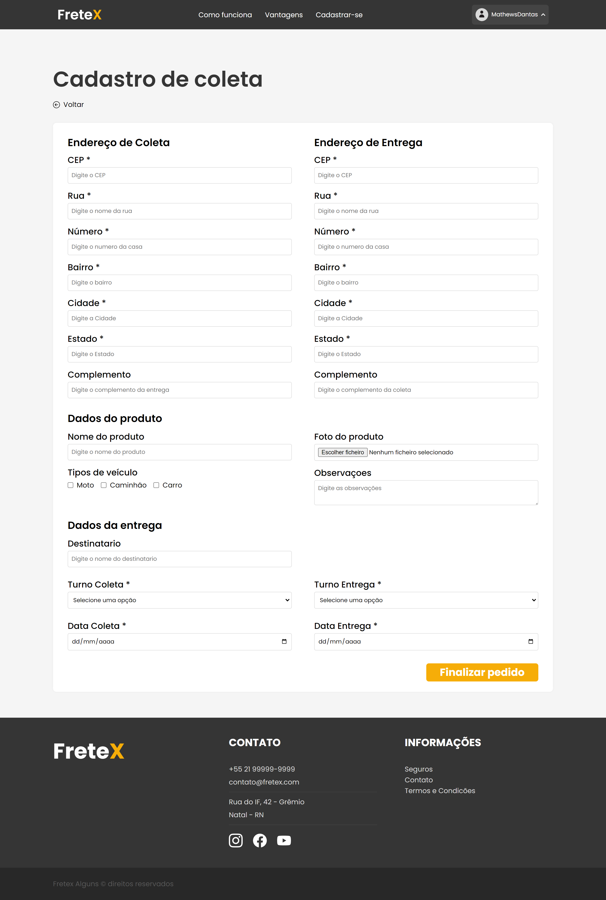

## 
 FRETEX 

**Especificação de Caso de Uso** 

## Cadastrar Pedido de Frete(Cliente).

## Histórico da Revisão

|**Data** |**Versão** |**Descrição** |**Autor** |
| - | - | - | - |
|08/06/2022 |1.0 |Detalhamento incial. |Italo Gabriel da Silva Monteiro |
|29/10/2022 |2.0 |Segunda versão. |Italo Gabriel da Silva Monteiro |

## 1- Resumo:

- O cliente pode cadastrar um pedido de frete. 

## 2- Atores:
- Cliente 

## 3- Precondições:

- Estar logado. 

## 4- Fluxos de evento: 
**4.1-  Fluxo básico:** 

1. O  ator  seleciona  a  opção  cadastrar  pedido  de  frete  no  seu Dashboard. 
2. O sistema solicita os dados do pedido de frete: Tipo de produto, tipo  de  veículo,  data  de  coleta,  data  de  entrega,  origem,  destino, observação. 
3. O ator preenche todos os dados e confirma o cadastro do pedido. 
4. O sistema verifica se todos os dados foram preenchidos de forma correta. 
5. O sistema cadastra o pedido de frete e coloca-o em situação de “em negociação”. 

**4.2- Fluxo de Exceção – Dados inválidos ou incompletos para a abertura do pedido de frete:** 

1. O sistema informará ao ator que o dado em questão foi preenchido de forma incorreta e pede que ele preencha novamente.  
2. O ator preenche de forma correta e solicita novamente a validação do sistema. 
3. O  sistema  valida  novamente  os  dados  e  finaliza  o  cadastro  do pedido de frete. 

## 5- Protótipo(s) de interface do Cadastrar Pedido de Frete:

