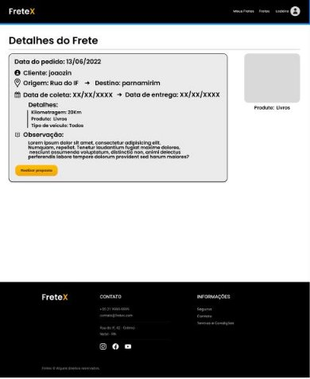
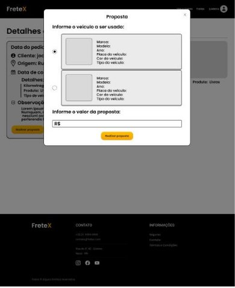
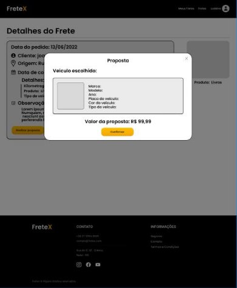

## 
 FRETEX 

**Especificação de Caso de Uso** 

## Realizar proposta(Freteiro).

## Histórico da Revisão 

|**Data** |**Versão** |**Descrição** |**Autor** |
| - | - | - | - |
|11/06/2022 |1.0 |Detalhamento inicial. |Marcos Alexandre Oliveira |
|29/10/2022 |2.0 |Segunda versão. |Italo Gabriel da Silva Monteiro |

## 1- Resumo: 

- Permite que o freteiro submeta uma proposta para um pedido de frete. 

## 2- Atores:

- Freteiro. 

## 3- Precondições: 

- Estar logado no sistema e existir um pedido de frete. 

## 4-Fluxos de evento: 
* 4.1-  Fluxo básico:** 

1. O ator seleciona a opção “Realizar proposta”. 
2. O sistema pede para o ator informar o valor da proposta. 
3. O ator informa o valor. 
4. O ator finaliza a ação “Realizar proposta”. 
5. O sistema pede uma verificação do valor da proposta. 
6. O ator confirma o valor. 
7. O ator seleciona a opção submeter proposta. 
8. O sistema confirma a submissão da proposta. 
9. O sistema cadastra a proposta na lista de propostas para aquele pedido de frete. 

**4.2 Fluxo de Exceção – Submissão de valor inválido:** 

1. O  ator  submete  uma  proposta  inválida(digita  letras  ou  um  valor maior que a proposta anterior).  
2. O sistema pede para que o ator cadastre uma proposta válida.  
3. O ator cadastra uma proposta válida.  
4. O ator seleciona a opção submeter proposta. 
5. O sistema pede uma verificação do valor da proposta. 
6. O ator confirma o valor. 
7. O ator finaliza a ação de realizar proposta. 
8. O sistema confirma a submissão da proposta. 
9. O  sistema  cadastra  a  proposta  na  lista  de  ofertas  para  aquele pedido de frete. 

## 5- Protótipo(s) de interface do Realizar Proposta(freteiro):

