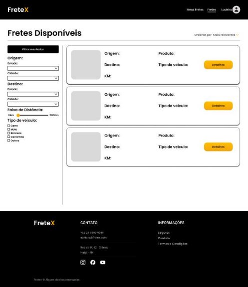

## 
 FRETEX 

**Especificação de Caso de Uso** 

## Listar fretes disponíveis 

## Histórico da Revisão 

|**Data** |**Versão** |**Descrição** |**Autor** |
| - | - | - | - |
|12/06/2022 |1.0 |Detalhamento inicial. |Sávio Araújo Carvalho Alves |

## 1- Resumo: 

- Permite listar todos os fretes disponíveis para o freteiro realizar propostas. 

## 2- Atores: 

- Freteiro. 

## 3- Precondições: 

 - Estar logado no sistema. 

## 4-Fluxos de evento: 
**4.1-  Fluxo básico:** 

1. O Freteiro acessa a página dashboard no menu de navegação. 
2. O sistema apresenta todos os fretes disponíveis. 

**5- Protótipo(s) de inteface do Listar Fretes Disponíveis:**  

