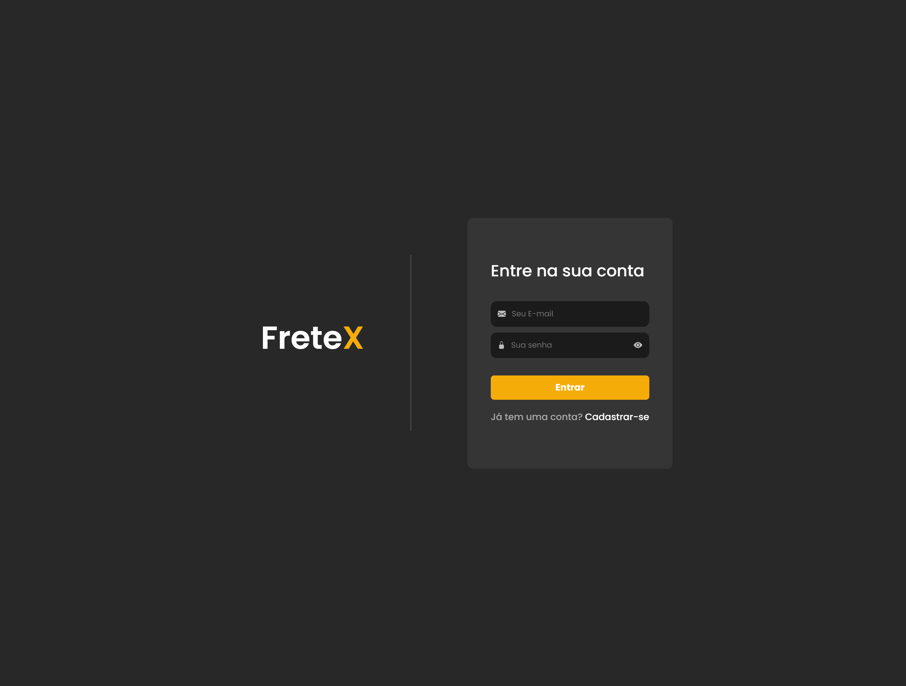

## 
 FRETEX 

**Especificação de Caso de Uso** 

## Realizar Login.

## Histórico da Revisão 

|**Data** |**Versão** |**Descrição** |**Autor** |
| - | - | - | - |
|09/06/2022 |1.0 |Detalhamento inicial. |Mathews Dantas. |

## 1- Resumo: 

 O ator pode utilizar os seus email e senha para entrar na plataforma como cliente ou freteiro.

## 2- Atores:
 - Cliente e Freteiro.

## 3- Precondições: 

 - O ator deve estar cadastrado. 

## 4-Fluxos de evento: 
**4.1-  Fluxo básico:** 

1. O ator seleciona a opção “ Login”.
2. O sistema solicita o email e a senha do ator.
3. O ator informa o email e senha.
4. O ator finaliza o Login.
5. O sistema inicia a sessão no dashboard do ator.

## 5- Protótipo(s) de interface do Realizar Login:

