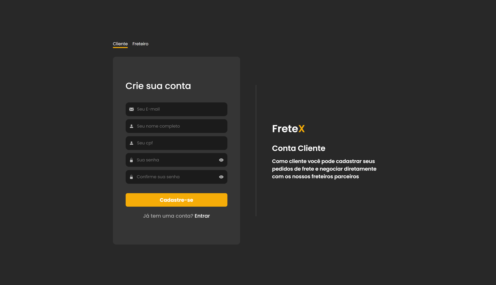

## 
 FRETEX 

**Especificação de Caso de Uso** 

## Cadastrar cliente.

## Histórico da Revisão 

|**Data** |**Versão** |**Descrição** |**Autor** |
| - | - | - | - |
|09/06/2022 |1.0 |Detalhamento inicial. |Mathews Dantas. |

## 1- Resumo: 

 - O cliente pode realizar o seu próprio cadastro na plataforma. 

## 2- Atores:
 - Cliente. 

## 3-Fluxos de evento: 
**3.1-  Fluxo básico:** 

1. 	O ator seleciona a opção “ Cadastrar-se”.
2.	O sistema solicita os dados do cliente: Nome, email, cpf e senha.
3.	O ator preenche os dados necessários.
4. 	O ator finaliza o cadastro.
5.	O sistema adiciona o novo cliente.
 

**3.2 Fluxo de Exceção (2):** 

a. Se o ator não preencher os dados, o sistema retorna uma mensagem de erro.

b. Se já existir uma conta com os email que o ator informou, o sistema retorna uma mensagem de ajuda.

## 4- Protótipo(s) de interface do Realizar Proposta(cliente):

