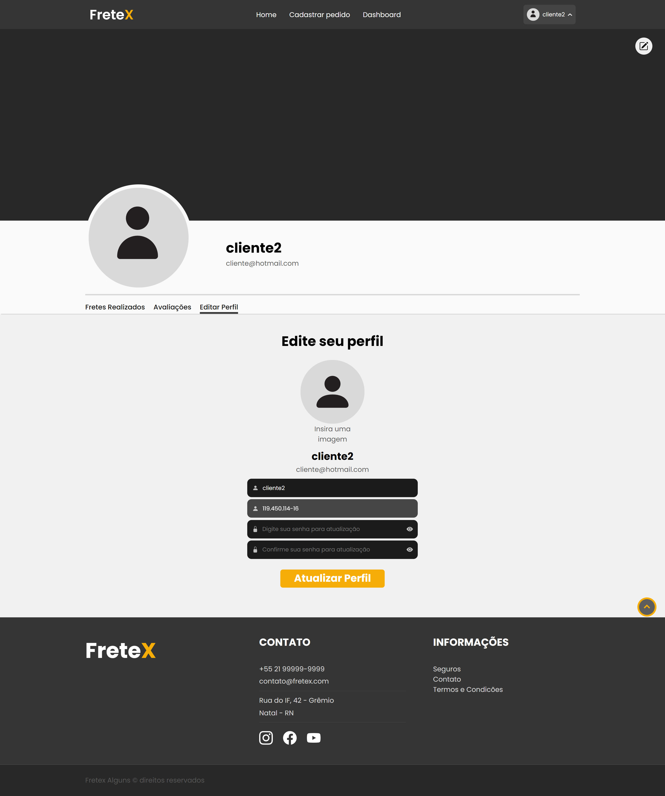

## 
 FRETEX 

**Especificação de Caso de Uso** 

## Atualizar Cliente.

## Histórico da Revisão 

|**Data** |**Versão** |**Descrição** |**Autor** |
| - | - | - | - |
|09/06/2022 |1.0 |Detalhamento inicial. |Mathews Dantas. |

## 1- Resumo: 

 - O cliente pode atualizar seu perfil.

## 2- Atores:
 - Cliente. 

## 3- Precondições: 

 - Estar logado.

## 4-Fluxos de evento: 
**4.1-  Fluxo básico:** 

1.  O ator seleciona a opção “ Atualizar Perfil”.
2.	O sistema solicita os dados que o ator deseja alterar.
3.	O ator preenche os dados desejados.
4. 	O ator finaliza a atualização.
5.	O sistema altera os dados informado pelo ator.

## 4- Protótipo(s) de interface do Atualizar Cliente:

