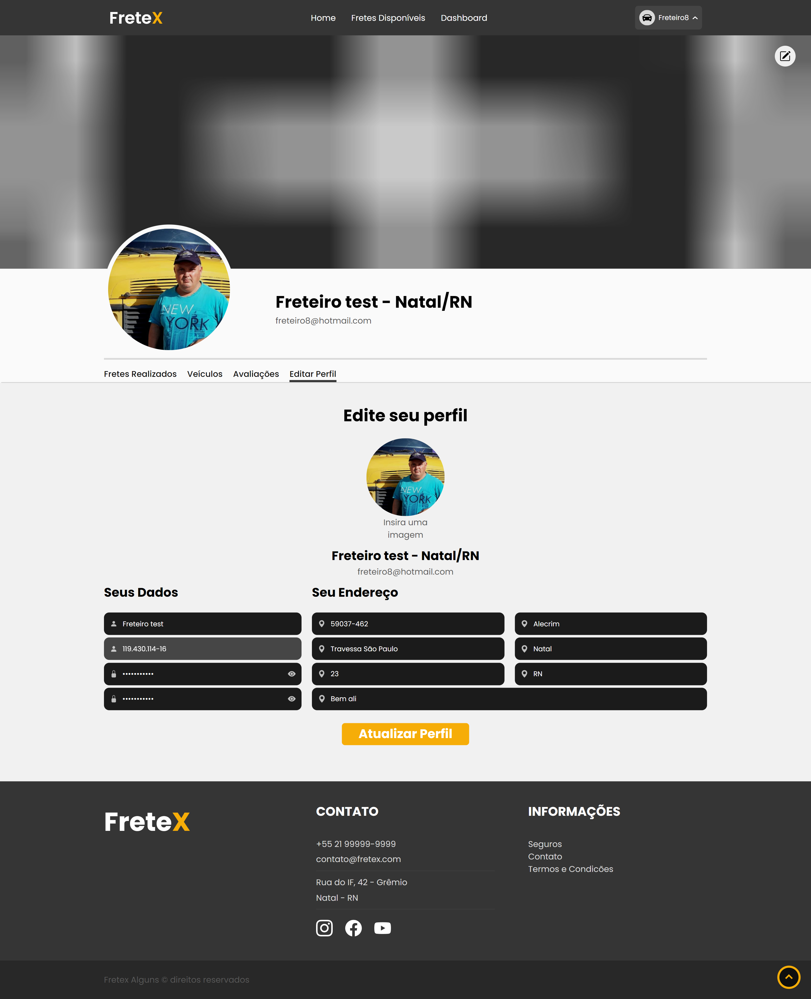

## 
 FRETEX 

**Especificação de Caso de Uso** 

## Atualizar Freteiro.

## Histórico da Revisão 

|**Data** |**Versão** |**Descrição** |**Autor** |
| - | - | - | - |
|09/06/2022 |1.0 |Detalhamento inicial. |Marcos Alexandre Oliveira. |

## 1- Resumo: 

 - Permite que o freteiro atualize seus dados de cadastro.

## 2- Atores:
 - Freteiro. 

## 3- Precondições: 

 - Estar logado no sistema. 

## 4-Fluxos de evento: 
**4.1-  Fluxo básico:** 

1.  O ator seleciona a opção “ Atualizar Perfil”.
2.	O sistema solicita os dados que o ator deseja alterar, não podendo alterar o CPF.
3.	O ator preenche os dados desejados.
4. 	O ator finaliza a atualização.
5.	O sistema altera os dados informado pelo ator.

**4.2 Fluxo de Exceção(4):** 

1. 	O ator seleciona a informação que deseja alterar.
2.	O ator deixa o campo em branco.
3. 	O sistema retorna erro de submissão por falta de preenchimento dos campos obrigatórios.
4.	O ator preenche o campo que estava em branco.
5.	O ator clica em submeter as alterações.
6.	O sistema pede para o ator confirmar os dados alterados.
7.	O ator confirma a submissão dos dados alterados.
8.	O sistema apresenta uma mensagem de confirmação de envio. 
9.	O sistema cadastra as novas informações no banco de dados.

## 5- Protótipo(s) de interface do Atualizar Freteiro:

