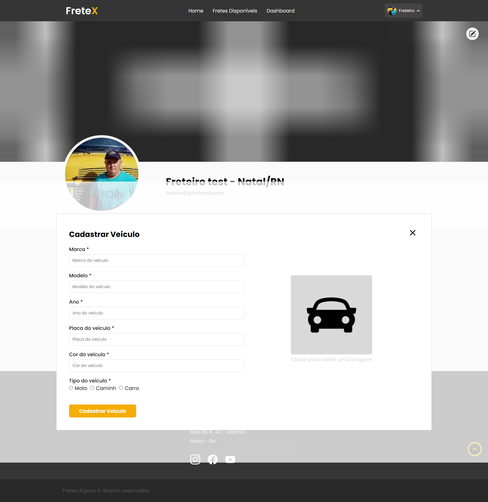

## 
 FRETEX 

**Especificação de Caso de Uso** 

## Cadastrar Veículo.

## Histórico da Revisão 

|**Data** |**Versão** |**Descrição** |**Autor** |
| - | - | - | - |
|12/06/2022 |1.0 |Detalhamento inicial. |Sávio Araújo Carvalho Alves. |

## 1- Resumo: 

 - Permite que o ator cadastre um veículo.

## 2- Atores:
 - Freteiro. 

## 3- Precondições: 

 - O Ator deve estar logado no sistema.

## 4-Fluxos de evento: 
**4.1-  Fluxo básico:** 

1. 	O ator seleciona a opção “Veículos” em seu perfil.
2.	O sistema redireciona o ator para a secção “veículos”.
3.	O sistema apresenta a listagem de veículos.
4.	O ator seleciona a opção para cadastrar veículo.
5.	O sistema pede os dados do veículo.
6.	O ator insere marca, modelo, ano, placa do veículo, cor do veículo e tipo do veículo.
7.	O sistema pede para confirmar o cadastro de veículo.
8.	O ator confirma cadastro do veículo.
9.	O sistema apresenta confirmação de veículo cadastrado.
10.	O sistema adiciona o veículo.

**4.2 Fluxo de Exceção(6):** 

1. 	O sistema apresenta alerta de dados inválidos.
2.	O sistema pede para o ator inserir dados válidos.
3.	O ator insere dados válidos.
4.	O fluxo retorna a partir do passo 7.

## 5- Protótipo(s) de interface do Cadastrar Veículo:

