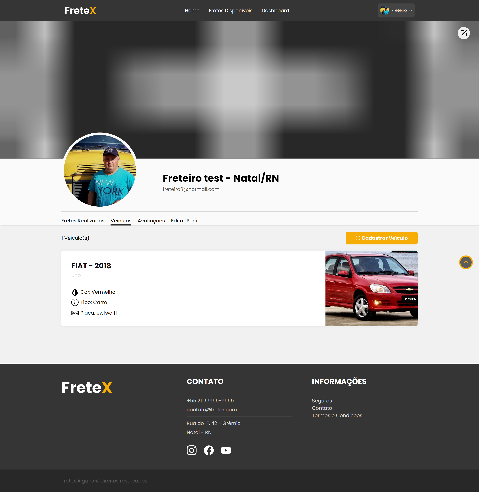

## 
 FRETEX 

**Especificação de Caso de Uso** 

## Listar Veículos.

## Histórico da Revisão 

|**Data** |**Versão** |**Descrição** |**Autor** |
| - | - | - | - |
|12/06/2022 |1.0 |Detalhamento inicial. |Sávio Araújo Carvalho Alves. |

## 1- Resumo: 

 - Permite que o ator liste os veículos cadastrados.

## 2- Atores:
 - Freteiro. 

## 3- Precondições: 

 - Estar logado no sistema. 

## 4-Fluxos de evento: 
**4.1-  Fluxo básico:** 

1. O ator seleciona a opção “Veículos”.
2. O sistema redireciona o ator para a secção “Veículos”.
3. O sistema apresenta a listagem dos veículos do ator.

## 5- Protótipo(s) de interface do Listar veículos:

