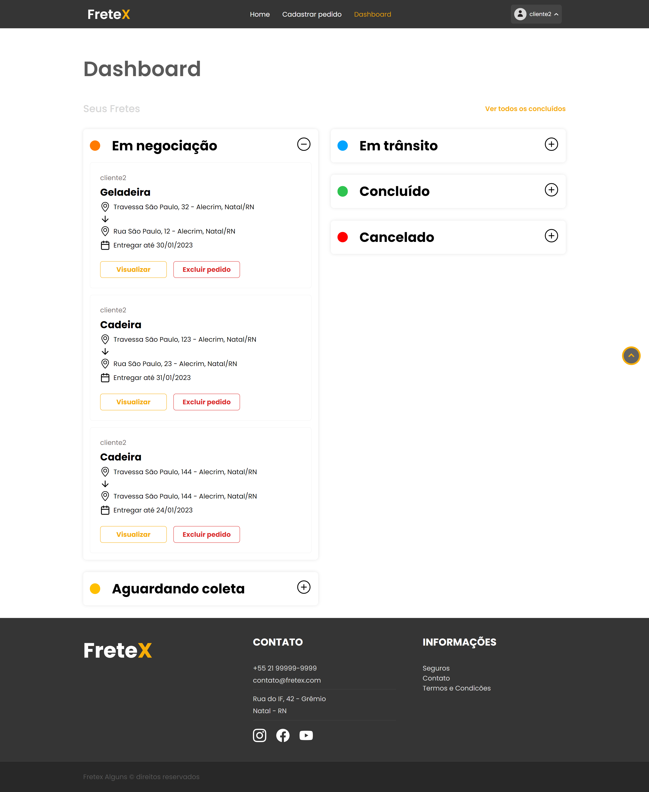

## 
 FRETEX 

**Especificação de Caso de Uso** 

## Deletar Pedido de Frete.

## Histórico da Revisão 

|**Data** |**Versão** |**Descrição** |**Autor** |
| - | - | - | - |
|08/06/2022 |1.0 |Detalhamento inicial. |Italo Gabriel da Silva Monteiro. |

## 1- Resumo: 

 - O cliente pode deletar um pedido de frete em aberto.

## 2- Atores:
 - Cliente. 

## 3- Precondições: 

 - Estar logado e possuir pelo menos um pedido de frete status "em andamento". O pedido não pode estar em transporte.

## 4-Fluxos de evento: 
**4.1-  Fluxo básico:** 

1.  O ator seleciona o pedido de frete que deseja deletar.
2.	O ator seleciona a opção "Excluir Pedido".
3.	O sistema exibe o pedido que será deletado e pede a confirmação do cliente.
4.	O cliente confirma a ação.
5.	O sistema deleta o pedido em questão do banco de dados e emite uma confirmação visual.

## 5- Protótipo(s) de interface do Deletar Pedido de Frete:

