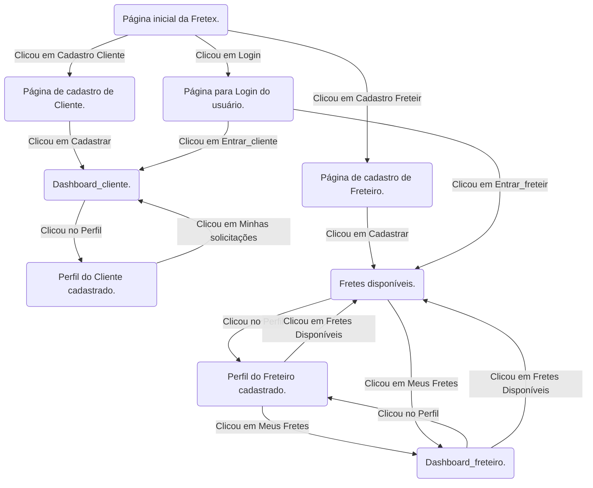

# Mapa do Site para plataforma Fretex.

Versão produzida em 02/06/2022

```mermaid
flowchart TD
  index(Página inicial da Fretex.)
  login(Página para Login do usuário.)
  cadastro_cliente(Página de cadastro de Cliente.)
  cadastro_freteiro(Página de cadastro de Freteiro.)
  perfil_freteiro(Perfil do Freteiro cadastrado.)
  perfil_cliente(Perfil do Cliente cadastrado.)
  meus_fretes_freteiro(Dashboard_freteiro.)
  meus_fretes_cliente(Dashboard_cliente.)
  fretes_disponíveis_freteiro(Fretes disponíveis.)
  
  
  index -- Clicou em Login--> login
  index -- Clicou em Cadastro Freteiro--> cadastro_freteiro
  index -- Clicou em Cadastro Cliente--> cadastro_cliente
  
 
  cadastro_freteiro -- Clicou em Cadastrar --> fretes_disponíveis_freteiro
  cadastro_cliente -- Clicou em Cadastrar --> meus_fretes_cliente
  
  login -- Clicou em Entrar_freteiro--> fretes_disponíveis_freteiro
  login -- Clicou em Entrar_cliente--> meus_fretes_cliente
  
  perfil_freteiro -- Clicou em Meus Fretes--> meus_fretes_freteiro
  meus_fretes_freteiro -- Clicou no Perfil--> perfil_freteiro
  perfil_cliente -- Clicou em Minhas solicitações--> meus_fretes_cliente
  meus_fretes_cliente -- Clicou no Perfil--> perfil_cliente
  
  fretes_disponíveis_freteiro -- Clicou no Perfil --> perfil_freteiro
  perfil_freteiro -- Clicou em Fretes Disponíveis --> fretes_disponíveis_freteiro
  fretes_disponíveis_freteiro -- Clicou em Meus Fretes --> meus_fretes_freteiro
  meus_fretes_freteiro -- Clicou em Fretes Disponíveis --> fretes_disponíveis_freteiro
  
```
